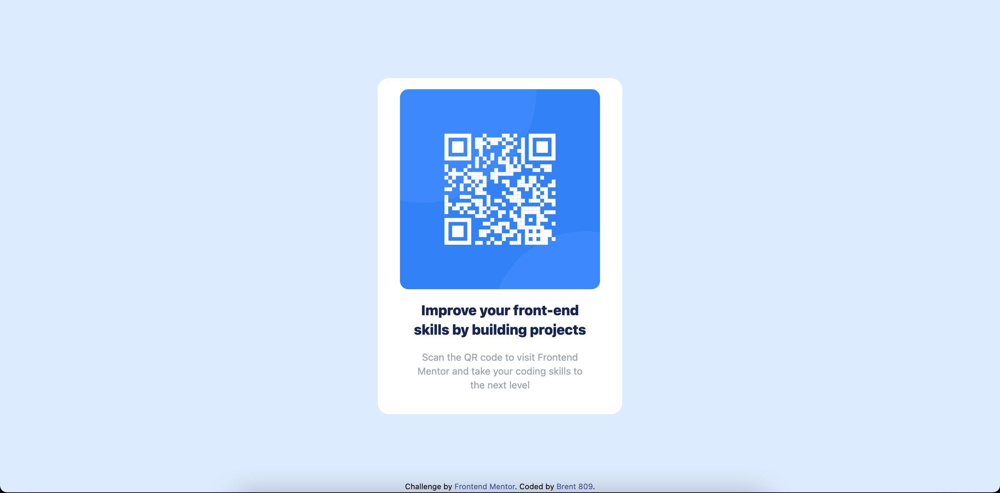

# Frontend Mentor - QR code component solution

This is a solution to the [QR code component challenge on Frontend Mentor](https://www.frontendmentor.io/challenges/qr-code-component-iux_sIO_H). Frontend Mentor challenges help you improve your coding skills by building realistic projects. 

## Table of contents

- [Overview](#overview)
  - [Screenshot](#screenshot)
  - [Links](#links)
- [My process](#my-process)
  - [Built with](#built-with)
  - [Useful resources](#useful-resources)
- [Author](#author)

## Overview

### Screenshot

### Links

- Live Site URL: [Add live site URL here](https://brent809.com/qr/)

## My process

### Built with

- Semantic HTML5 markup
- Flexbox
- CSS Grid
- [Tailwind](https://tailwindcss.com/) - For styles

### Useful resources

- [Example resource 1](https://tailwindcss.com/) - This helped me for XYZ reason. I really liked this pattern and will use it going forward.

## Author

- Website - [Add your name here](https://brent809.com/)
